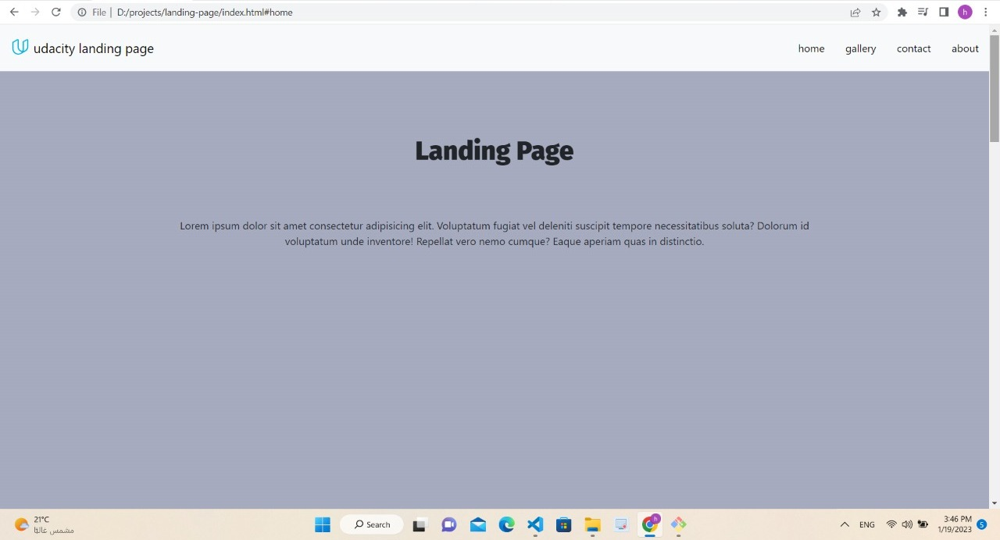

# 1- Landing Page Project 

## 2- project description

   Hello, this is landing page . i used html,css,javascript to achieve the functions.
   the challenge that i met in that project :- :bookmark_tabs:

        - Creating a navbar with JavaScript has some items. When I click on an item, it goes to its section .

## 3- Table of Contents:

    landing page : 
     1-navbar => logo in left 
                 ul in right have items (home, gallery, contact, about ).
     2-body => first page have landing page header and text.
               four sections.
               button go to top
     3-footer => Udacity copy right .
                 created by me.

## 4- what i use in this project

    1- navbar => use bootstrap classes padding - navbar brand and another classes in left logo.
                 in right create ul an li using java script .
    2- body => use function in java script to create dynamic sections .
                In this function, I relied on Osama Al-Zero in making the scroll and w3school in linking the li with his section .
                use Intersection Observer API in MDN to create function active class when user scroll or click in li item.

### my project 😊

    => this is image is for the front-end page of my project . 

    

    => this is image is for home section .
    

### reference links 

    you can find Intersection Observer API here :

    *[links](#MDN)
    
    <https://developer.mozilla.org/en-US/docs/Web/API/Intersection_Observer_API> 

* [Instructions](#instructions)

## Instructions

The starter project has some HTML and CSS styling to display a static version of the Landing Page project. You'll need to convert this project from a static project to an interactive one. This will require modifying the HTML and CSS files, but primarily the JavaScript file.

To get started, open `js/app.js` and start building out the app's functionality

For specific, detailed instructions, look at the project instructions in the Udacity Classroom.
